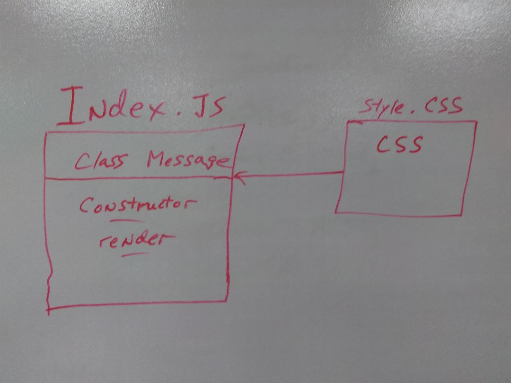
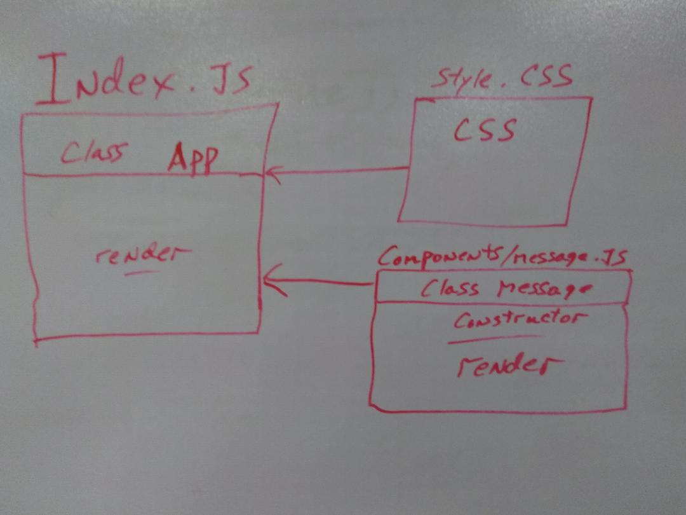
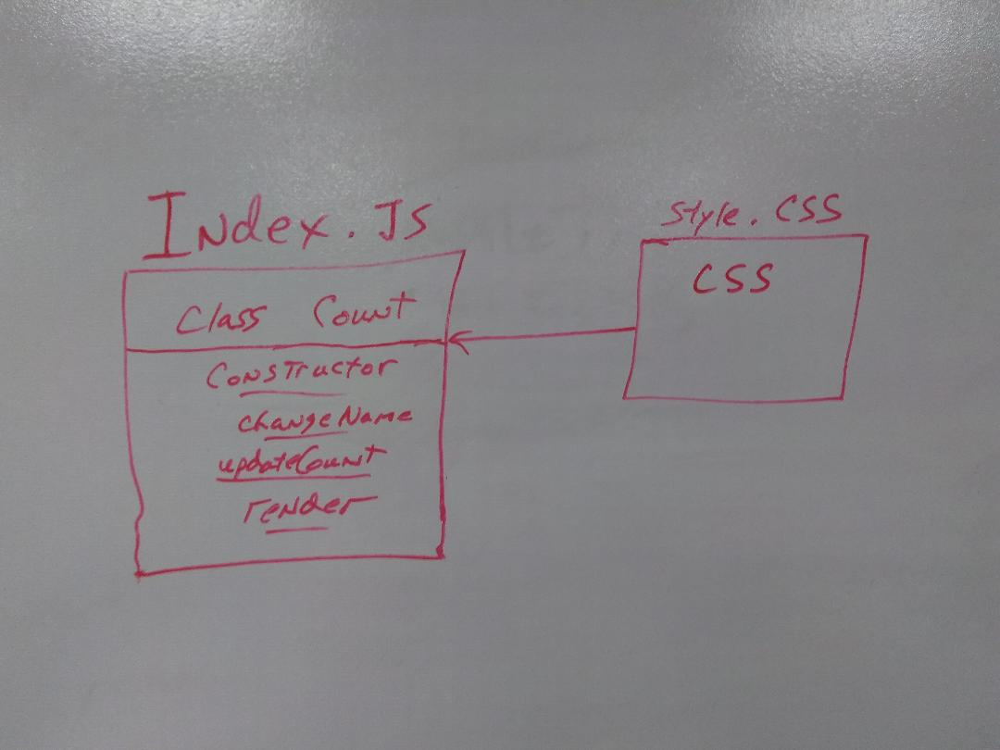
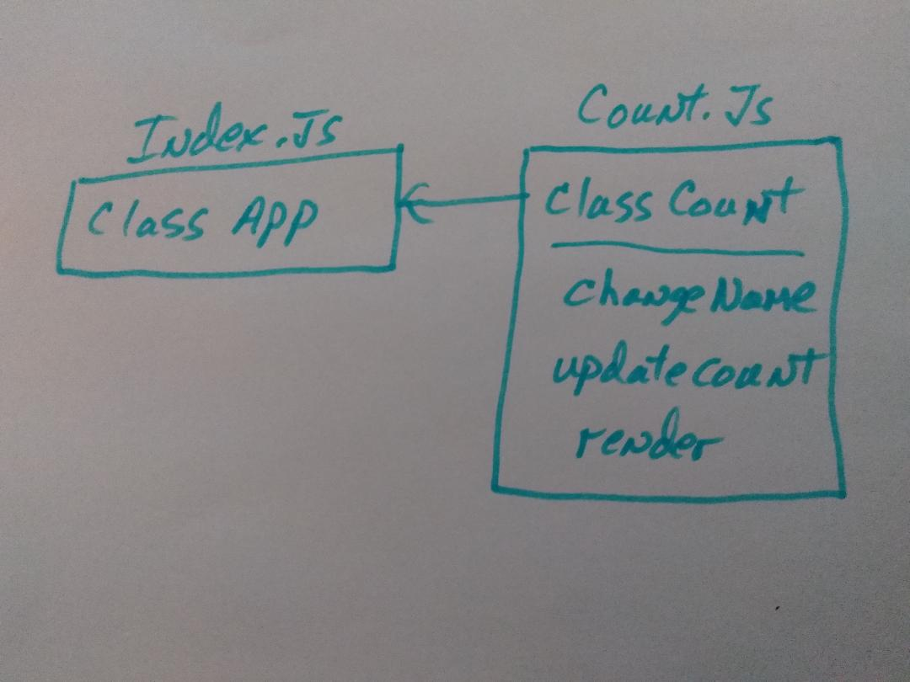
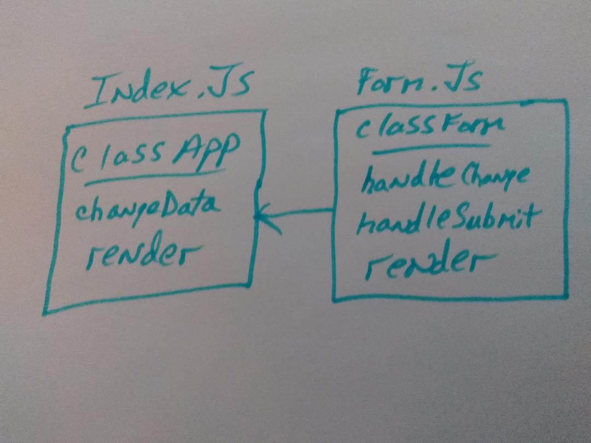
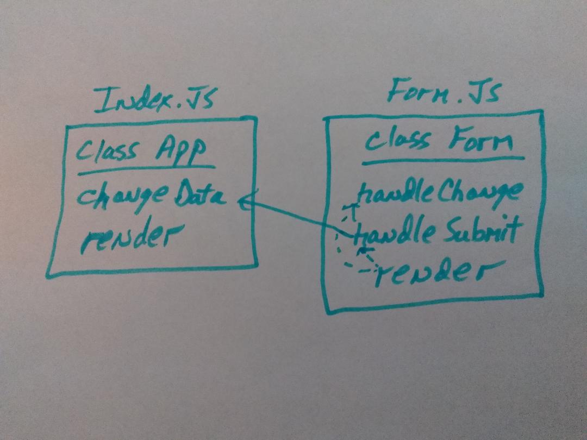

 LAB
=================================================

## Lab 28

### Author: Ed Puzino

### Links and Resources
* [sandbox](https://codesandbox.io/s/mzx06ow82y) Assignment 1, Part 1
* [sandbox](https://codesandbox.io/s/6194931m8w) Assignment 1, Part 2
* [sandbox](https://codesandbox.io/s/kwzknxvlk3) Assignment 2, Part 1
* [sandbox](https://codesandbox.io/s/1r6m20o38q) Assignment 2, Part 2
* [sandbox](https://codesandbox.io/s/6ym16lz3qk) Assignment 3, Part 1
* [sandbox](https://codesandbox.io/s/0yx2y46v70) Assignmnet 3, Part 2
* [repo](https://github.com/edpuzino/lab-28)
* [travis](https://travis-ci.com/edpuzino/lab-28)

### Modules
#### `Message.js`
##### Exports 'Hello World'

#### `Count.js`
##### Accepts a name and updates count when submitted'

#### `Form.js`
##### Accepts a name and updates it as entered and when submitted sends the state up to the main app to update the counter.

### Setup

* `Code is running on code sand box` 
* `Link is above`

#### Tests
* How do you run tests?
* What assertions were made?
* What assertions need to be / should be made?

#### UML
 Assignment 1, Part 1 
 Assignment 1, Part 2
 Assignment 2, Part 1
 Assignment 2, Part 2
 Assignment 3, Part 1
 Assignment 3, Part 2
